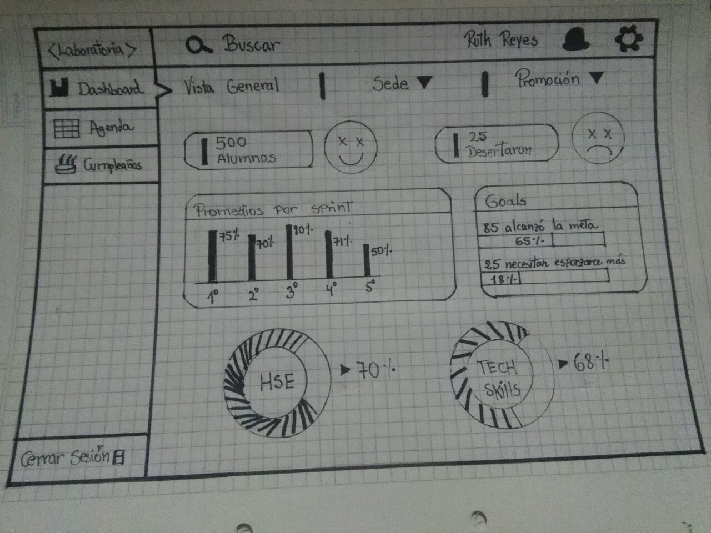

## SKETCH DASHBOARD LABORATORIA
### INTRODUCCIÓN
En este reto opté por desarrollar un sketch sencillo, siguiendo las siguientes recomendaciones:
En el dashboard, los usuarios mencionados pueden ver rápidamente estadísticas y datos en tiempo real como:

* número de alumnas inscritas
* número de alumnas que desertaron
* número y % de alumnas que pasan el criterio mínimo de evaluación
* Promedio de notas por sprint
* Promedio de notas HSE
* Promedio de notas técnicas
Además, dado que Laboratoria tiene muchas generaciones, regularmente 2 generaciones por año (estas generaciones empezaron en el 2014), y que opera en 4 sedes (Arequipa, Ciudad de México, Lima y Santiago de Chile), es posible que los usuarios quieran ver datos de sedes / generaciones anteriores para poder hacer comparaciones.

### RESULTADO
En esta visualización se muestra datos generales desde un menú local, pero en la parte superior quien inició sesión puede eleguir mediante un menú la sede o promoción que sea de su interés.

